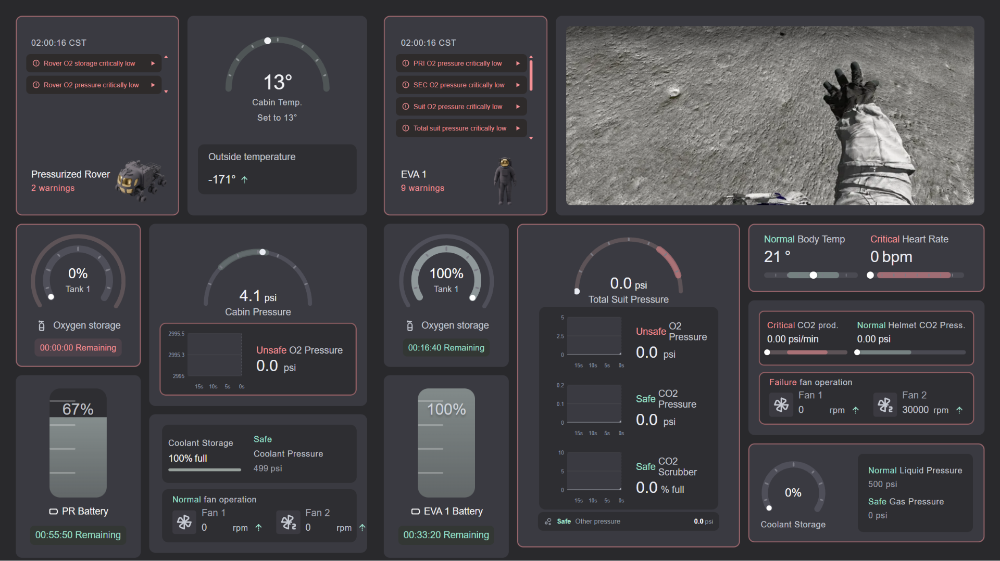
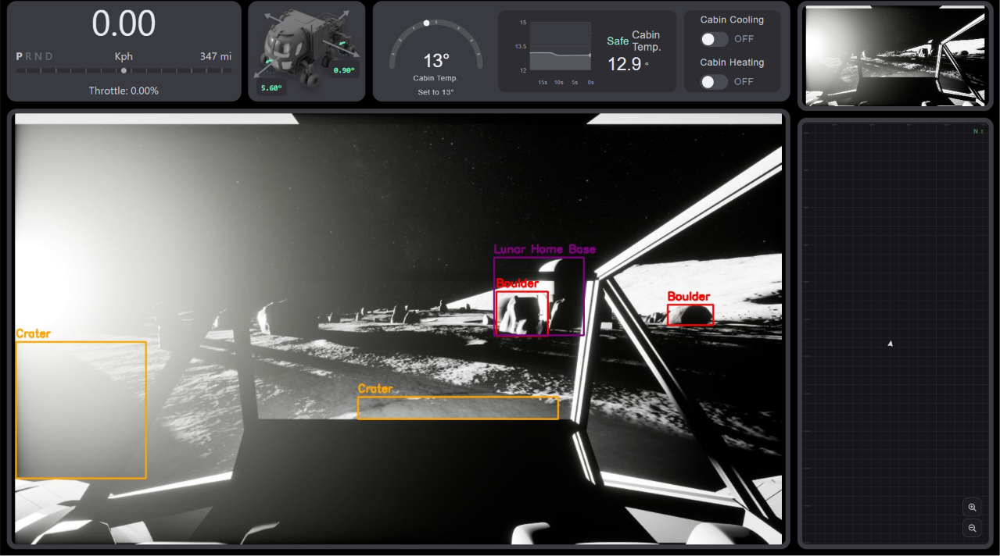
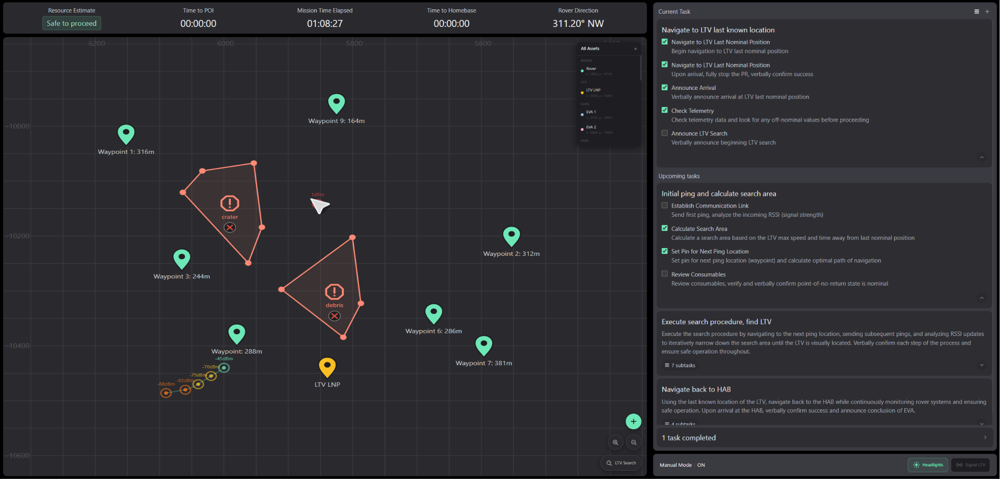
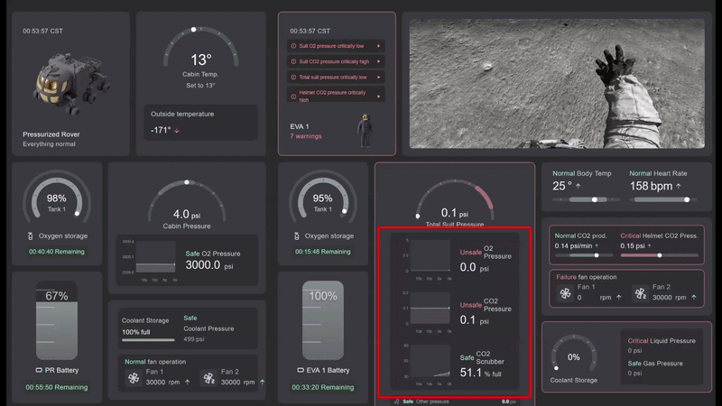
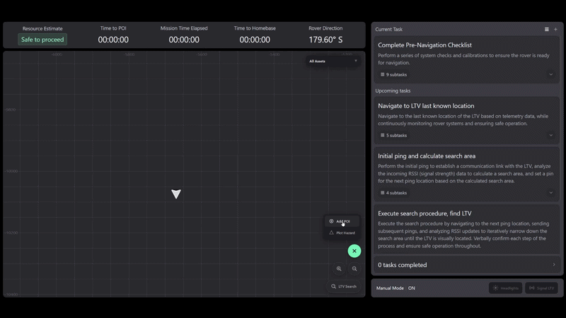
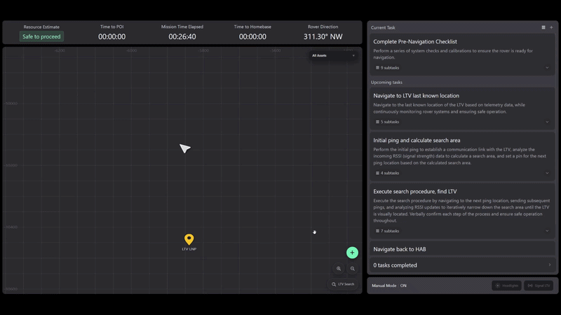
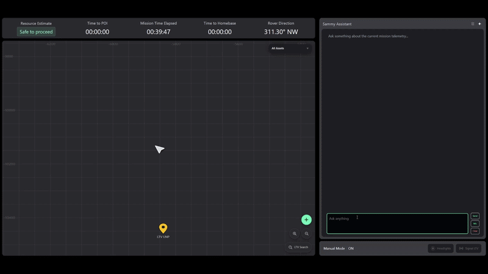
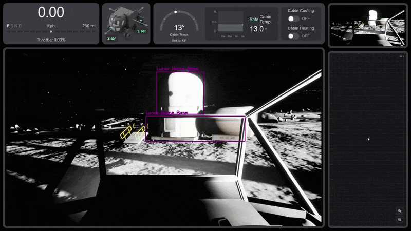

# Pressurized Rover Intelligence Platform (OWL SUITS 2026)

Rice University's submission for the [NASA SUITS 2026 Challenge](https://www.nasa.gov/learning-resources/spacesuit-user-interface-technologies-for-students/).

NASA SUITS (Spacesuit User Interface Technologies for Students) is a challenge that tasks university teams with designing and building software interfaces for astronaut spacesuits and rovers. For the 2026 competition, we built a three-screen display system that helps astronauts autonomously navigate the lunar south pole and search for a damaged Lunar Terrain Vehicle (LTV).

The interface is designed to reduce astronaut cognitive load during high-stakes tasks. We validate this through human-in-the-loop testing grounded in human factors research, measuring how interface design choices affect operator performance and mental workload.

Our design was selected as one of the top 5 designs in the nation, earning us the opportunity to test our interface in person at the Johnson Space Center.

<table align="center" border="0" cellspacing="10" cellpadding="0">
  <tr>
    <td align="center"><b>Telemetry Screen</b></td>
    <td align="center"><b>Driver Screen</b></td>
    <td align="center"><b>Map Screen</b></td>
  </tr>
  <tr>
    <td></td>
    <td></td>
    <td></td>
  </tr>
</table>

## Navigation
- [Features](#features)
  - [Telemetry Dashboard](#telemetry-dashboard)
  - [Dynamic Map & LTV Search](#dynamic-map--ltv-search)
  - [AI Assistant](#ai-assistant)
  - [Autonomous Navigation](#autonomous-navigation)
- [Presentations & Media](#presentations--media)
- [Developer Guides](#developer-guides)
- [Getting Started](#getting-started)
  - [Installation Prerequisites](#installation-prerequisites)
  - [Setup](#setup)
  - [Running the App](#running-the-app)

## Features

### Telemetry Dashboard
- Live monitoring of EV and PR telemetry, dynamic warning system, and trend graphs.

<p align="center">
  
</p>

---

### Dynamic Map & LTV Search
- Dynamic map displaying hazards and projected path.
- Autonomous LTV search using location pings and gradient ascent.

<table align="center" border="0" cellspacing="10" cellpadding="0">
  <tr>
    <td></td>
    <td></td>
  </tr>
</table>

---

### AI Assistant
- RAG system with deep integration into mission procedures and telemetry warning handling. 
- Supports voice control and widget generation for fast visual feedback.

<p align="center">
  
</p>

---

### Autonomous Navigation
- Computer vision pipeline using a fine-tuned YOLOv26s model to identify obstacles like craters and boulders. 
- Automatic obstacle avoidance and steering to target position, deeply integrated with manual controls to keep humans in the loop.

<p align="center">
  
</p>

## Presentations & Media
- [Project Proposal](docs/resouces/proposal.pdf)
- [Software Design Review](https://docs.google.com/presentation/d/1mcC3QHHZB-tvO_A37ylLGBsO3wAHMOPN51M1vWQV4ro/edit?usp=sharing)
- [Critical Design Review](https://docs.google.com/presentation/d/1mOYTwAb0BdUdTh-dxteZSn3tDG_9F39MJ5hq5R-FRUo/edit?usp=sharing)
- [Exit Pitch Slides](https://docs.google.com/presentation/d/17pI6eu1O87Ero6XG_PJkbaEzfBmWmDGLCrxGnhLNep8/edit?usp=sharing)
- [Exit Pitch Recording](https://www.youtube.com/live/VIQ5LbNfwNY?t=8556&si=ZFugoQ2kFGSLxOyk)

## Developer Guides

- [Frontend Guide](docs/frontend.md)
- [Backend Guide](docs/backend.md)
- [Dev Guide](docs/dev-guide.md)
- [GitHub Workflow](docs/github.md)
- [Example](docs/example.md)


## Getting Started

### Installation Prerequisites
- [Docker Desktop](https://www.docker.com/products/docker-desktop/)
- [VS Code](https://code.visualstudio.com/) with the [Dev Containers](https://marketplace.visualstudio.com/items?itemName=ms-vscode-remote.remote-containers) extension
- [Ollama](https://ollama.com/) (Ollama 3.2 or Gemma 4, nomic-embed-text)
- [DUST](https://software.nasa.gov/software/MSC-27522-1)
- [PR-Tools](https://github.com/Rice-ARVR/PR-Tools) Stream Server Required for Teleop
- [TSS](https://github.com/SUITS-Techteam/TSS2026)

### Setup

1. Install all prerequisites.
2. Download Repository in VS Code, then when prompted click **Reopen in Container**.
3. Wait for the build. Dependencies are installed automatically.
4. Add .env to client folder
```bash
VITE_MEDIAMTX_URL=http://localhost:8889
VITE_STREAM_NAME=dust_stream
VITE_DUST_WS_URL=ws://host.docker.internal:8765
```
5. Add .env to server folder
```bash
TSS_HOST = Place TSS IP here 
```

### Running the App

1. Start TSS
2. Start DUST
3. Start DUST Streaming Server
4. Start the backend:

```bash
cd server
uv run fastapi dev main.py --host 0.0.0.0
```

5. Start the frontend:

```bash
cd client
npm run dev
```

#### Routes
- Telemetry Dashboard: `http://localhost:5173/telemetry`
- Driving Screen: `http://localhost:5173/screen`
- Map Screen: `http://localhost:5173/map`

The frontend will be available at `http://localhost:5173` and the api at `http://localhost:8000`.
